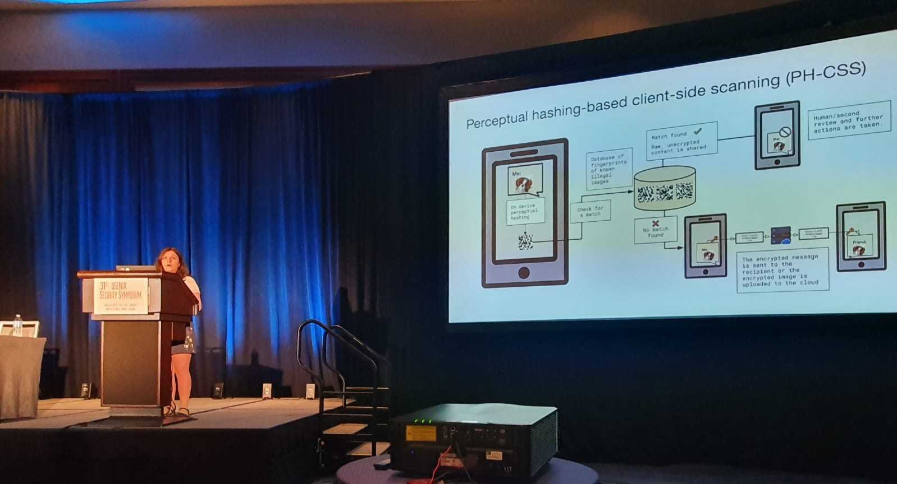

I am a final year PhD candidate in the [Computational Privacy Group](https://cpg.doc.ic.ac.uk/index.html) at [Imperial College London](https://www.imperial.ac.uk/), advised by [Dr. Yves-Alexandre de Montjoye](http://www.demontjoye.com/index.html). My research lies at the intersection between machine learning, privacy, and security. I study privacy and security vulnerabilities in data processing technologies: machine learning models, query-based systems, and perceptual hashing-based client-side scanning, through the lens of automated attacks. Through a rigorous study of privacy vulnerabilities, my research can inform the design of principled countermeasures allowing to prevent them and, ultimately, to use data safely.

Prior to starting my PhD, I obtained an MSc in Computer Science from [EPFL, Switzerland](https://www.epfl.ch/en/), and the _Diplome d'Ingénieur de l'Ecole Polytechnique_ (equivalent to a Bachelors and Master’s degree) from [Ecole Polytechnique, France](https://www.polytechnique.edu/en). At Ecole Polytechnique, I studied Pure and Applied Mathematics and Computer Science, and specialized in Data Science. Towards completion of my EPFL MSc degree, I did my Master Thesis in the [Department of Computer Science](https://www.cs.ox.ac.uk/) at the [University of Oxford](https://www.ox.ac.uk/) under the supervision of [Prof. Thomas Lukasiewicz](https://www.cs.ox.ac.uk/people/thomas.lukasiewicz/), and in close collaboration with [Dr. Oana-Maria Camburu](https://www.cs.ox.ac.uk/people/oana-maria.camburu/). My research there was on 1) developing deep learning-based approaches to solve the Winograd Schema Challenge and on 2) developing sentence representation models with the goal of improving interpretability and performance on a set of benchmark natural language processing tasks.

In the summer of 2022, I was a research intern in the Microsoft Research Confidential Computing team (Cambridge, UK). I worked on the privacy of machine learning models with Shruti Tople and Daniel Jones. In the summer of 2020, I was a research intern at Twitter (London, UK) in the graph learning team. I worked with Dr. Davide Eynard on the privacy of Twitter graph data. In 2017, I did a summer internship at Google (Boulder, Colorado, USA), in the Payments Compliance Engineering Team, where I was supervised by Craig Wright. In 2016, I did a 5-month internship at Google (Paris, France), where I was supervised by Dr. Sertan Girgin.

# News {#news}

12/05/2023: I successfully defended my PhD thesis! I am grateful to my examiners Prof. Vitaly Shmatikov and Prof. Emil Lupu for their feedback.

10/05/2023: I gave a talk about the limits of anonymisation and automating attacks against query-based systems at the Centre for Data Ethics and Innovation.

20/02/2023: I presented my work at the probability and statistics seminar of the University of Bourgogne France-Comte (Besancon).

09/11/2022: This week, I attended the ACM CCS 2022 conference in Los Angeles, USA. I presented my paper <a href="https://dl.acm.org/doi/abs/10.1145/3548606.3560581">QuerySnout: Automating the Discovery of Attribute Inference Attacks against Query-Based Systems</a>.

11/08/2022: Check out our <a href="https://cpg.doc.ic.ac.uk/blog/deephash-not-robust-to-detection-avoidance/">new blogpost </a> on the effectiveness of black-box evasion attacks against deep perceptual hashing models.

11/08/2022: This week, I attended the USENIX Security '22 conference in Boston, USA. I presented <a href="https://arxiv.org/abs/2106.09820">my paper</a> on evaluating the robustness of perceptual hashing-based client-side scanning systems.

 

22/07/2022: I completed my internship in Microsoft Research's Confidential Computing team and I am now back at Imperial! I will soon share more updates on the work.

13/07/2022: I received a diversity grant from the USENIX association for attending the USENIX Security '22 conference in Boston!

02/05/2022: I started an internship at Microsoft Research in the Confidential Computing team, working with [Shruti Tople](https://www.microsoft.com/en-us/research/people/shtople/) and [Daniel Jones](https://www.microsoft.com/en-us/research/people/jonesdaniel/).

30/03/2022: I presented my paper [Interaction data are identifiable even across long periods of time](https://doi.org/10.1038/s41467-021-27714-6) at the Privacy and Security Seminar, check out [this link](https://prisec-ml.github.io/students_ecrs/) for the recording.

# Research {#research}
## Publications
<small>\* denotes joint first authorship.</small>
<ol reversed>
    <li>
   <b>Crețu A.-M.*</b>, Houssiau, F.*, Cully, A. and de Montjoye Y.-A. QuerySnout: Automating the discovery of attribute inference
attacks against query-based systems. <i>In Proceedings of the 2022 ACM SIGSAC Conference on Computer and Communications Security (CCS '22).</i> <a href="https://dl.acm.org/doi/10.1145/3548606.3560581"> [Paper] </a> <a href="https://arxiv.org/abs/2211.05249">[Extended arXiv version]</a> <a href="https://github.com/computationalprivacy/querysnout">[Code]</a>
  </li>
  
  <li>
   <b>Crețu A.-M.</b>, Monti F., Marrone S., Dong X., Bronstein M. and de Montjoye Y.-A. Interaction data are identifiable even across long periods of time. <i> Nature Communications 13, 313 (2022).</i> <a href="https://doi.org/10.1038/s41467-021-27714-6">[Paper]</a>
    <ul>
      <li> Presented at the ACM CCS Privacy Preserving Machine Learning 2021 workshop  (<a href="https://ppml-workshop.github.io/">PPML 2021</a>). <b>Contributed talk.</b> </li>
      <li> Presented at the NeurIPS Privacy and Machine Learning 2021 workshop (<a href="https://nips.cc/Conferences/2021/ScheduleMultitrack?event=21873">PriML 2021</a>).</li>
      <li> Featured in <a href="https://www.sciencenews.org/article/ai-identify-anonymous-data-phone-neural-network">Science News.</a></li>
    </ul>
  </li>
  
  <li>
    Jain S.*, <b>Crețu A.-M.*</b> and de Montjoye Y.-A. Adversarial Detection Avoidance Attacks: Evaluating the robustness of perceptual hashing-based client-side scanning. <i> 31st USENIX Security Symposium (USENIX Security 22) </i> <a href="https://www.usenix.org/conference/usenixsecurity22/presentation/jain">[Paper]</a> <a href="https://arxiv.org/abs/2106.09820">[Extended arXiv version]</a>
    <ul>
      <li> Presented at the NeurIPS Privacy and Machine Learning 2021 workshop (<a href="https://nips.cc/Conferences/2021/ScheduleMultitrack?event=21873">PriML 2021</a>).</li>
      <li> Presented at the Conference on Applied Machine Learning for Information Security 2021 (<a href="https://www.camlis.org/">CAMLIS 2021</a>). <b>Oral presentation.</b></li>
      <li> Presented as a talk at the 14th Workshop on Hot Topics in Privacy Enhancing Technologies (<a href="https://petsymposium.org/2021/hotpets.php">HotPETS 2021</a>).</li>
      <li> Featured in <a href="https://www.imperial.ac.uk/news/231778/proposed-illegal-image-detectors-devices-easily/">Imperial College London News.</a></li>
    </ul>
  </li>
  
  <li> 
    Kocijan V., Camburu O.-M., <b>Crețu A.-M.</b>, Yordanov Y., Blunsom P. and Lukasiewicz T. WikiCREM: A Large Unsupervised Corpus for Coreference Resolution. <i>Proceedings of the 2019 Conference on Empirical Methods in Natural Language Processing and the 9th International Joint Conference on Natural Language Processing (EMNLP-IJCNLP) (2019)</i> <a href="https://aclanthology.org/D19-1439/">[Paper]</a> 
  </li>
  
  <li> 
    Kocijan V., <b>Crețu A.-M.</b>, Camburu O.-M., Yordanov Y. and Lukasiewicz T. A Surprisingly Robust Trick for the Winograd Schema Challenge. <i>Proceedings of the 57th Annual Meeting of the Association for Computational Linguistics (ACL 2019)</i> <a href="https://aclanthology.org/P19-1478/">[Paper]</a>
  </li>
</ol>

## Preprints

<ol reversed>
  <li>
   <b>Crețu A.-M.*</b>, Guépin F.* and de Montjoye Y.-A. Dataset correlation inference attacks against machine learning models. <i> arXiv preprint (2021)</i> <a href="https://arxiv.org/abs/2112.08806">[arXiv]</a>
  </li>
  
 </ol>

# Awards and scholarships {#awards}

<ul>
  <li> I am recipient of the USENIX '22 Diversity grant, which generously supported my trip to the conference in Boston. </li>
  <li> I am a recipient of the <a href="https://www.epfl.ch/education/studies/en/financing-study/grants/excellence-fellowships/">EPFL Excellence Fellowship</a> (awarded to students with outstanding academic records), which generously supported my studies at EPFL.</li>
  <li> My studies in France were supported by a competitive 2-year full scholarship from the <i>Fondation Odon Vallet</i> and by a 2.5-year scholarship from the <i> Fondation de l'Ecole Polytechnique</i>.</li>
  <li> I was born and grew up in Romania. There, I participated in many mathematics contests, including the Romanian National Olympiad, where I won one gold medal, three silver medals, and one bronze medal.</li>
</ul>
