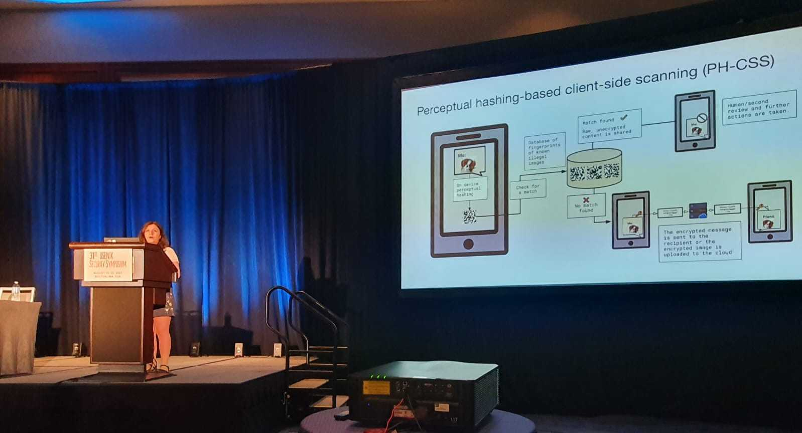



# 2024

16/10/2024: 🏆 Distinguished paper award for our paper [QueryCheetah: Fast Automated Discovery of Attribute Inference Attacks Against Query-Based Systems](https://arxiv.org/abs/2409.01992) at ACM CCS 2024! Very glad to see this line of work, started with [QuerySnout](https://dl.acm.org/doi/10.1145/3548606.3560581), recognized by the community.

10/10/2024: I gave an interview for EPFL Center for Digital Trust on the pitfalls of current proposals to use client-side scanning to detect illegal content in end-to-end-encrypted communications: [The Encryption Dilemma Protecting  privacy amid  rising security concerns](https://drive.switch.ch/index.php/s/EF2jZcfcOQWmHgY).

23/08/2024: New paper [QueryCheetah: Fast Automated Discovery of Attribute Inference Attacks Against Query-Based Systems](https://arxiv.org/abs/2409.01992) accepted at ACM CCS 2024! Joint work with Bozhidar Stevanoski and Yves-Alexandre de Montjoye.

17/07/2024: Our review paper on [Anonymization: The imperfect science of using data while preserving privacy](https://www.science.org/doi/10.1126/sciadv.adn7053) has been published in Science Advances. Joint work with Andrea Gadotti, Luc Rocher, Florimond Houssiau and Yves-Alexandre de Montjoye.

10/07/2024: Our paper [Correlation inference attacks against machine learning models](https://www.science.org/doi/10.1126/sciadv.adj9260) has been published in Science Advances! Joint work with Florent Guépin and Yves-Alexandre de Montjoye.

20/06/2024: 🏆 Best paper award for our paper [Re-pseudonymization Strategies for Smart Meter Data Are Not Robust to Deep Learning Profiling Attacks](https://dl.acm.org/doi/10.1145/3626232.3653272) at the ACM CODASPY '24 conference! Miruna Rusu, co-first author on the paper, presented the work in Porto, Portugal. 

08/06/2024: New paper [A Zero Auxiliary Knowledge Membership Inference Attack on Aggregate Location Data](https://arxiv.org/abs/2406.18671) accepted in PoPETS 2024! Joint work with Vincent Guan, Florent Guépin and Yves-Alexandre de Montjoye. 

26/02/2024: New paper [Re-pseudonymization Strategies for Smart Meter Data Are Not Robust to Deep Learning Profiling Attacks](https://dl.acm.org/doi/10.1145/3626232.365327) accepted at ACM CODASPY '24! Joint work with Miruna Rusu and Yves-Alexandre de Montjoye.

01/02/2024: New paper [Investigating the Effect of Misalignment on Membership Privacy in the White-box Setting](https://arxiv.org/abs/2306.05093) accepted at PoPETS 2024! Joint work with Daniel Jones, Yves-Alexandre de Montjoye, and Shruti Tople.

22/01/2024: I attended the discussion panel of the [Synthetic Data for Biomedical Applications](https://www.datascience.ch/event/synthetic-data-for-biomedical-applications) workshop organised by CHUV and the Swiss Data Science Center.

# 2023

01/11/2023: I started a postdoc at Ecole Polytechnique Fédérale de Lausanne (EPFL) in Switzerland. I am part of the [SPRING Lab](https://spring.epfl.ch/) headed by Prof. Carmela Troncoso. I am generously funded by the [CYD Distinguished Postdoctoral Fellowship](https://www.epfl.ch/research/funding/epfl-programmes/cyd/cyd-postdoc/) of the Swiss Cyberdefense Campus where my main collaborator is Dr. Raphael Meier.

24/07/2023: This week I visited Prof. Thorsten Strufe and his research group at KIT, spending a wonderful week in Karlsruhe.

11/07/2023: I participated in a panel on Data Protection in an AI-Driven World organised by the UK Internet Governance Forum, talking about how we can evaluate the privacy risks of AI models.

04/07/2023: New preprint available: [Synthetic is all you need: removing the auxiliary data assumption for membership inference attacks against synthetic data](https://arxiv.org/abs/2307.01701).

30/06/2023: This week I attended the Interdisciplinary Summerschool on Privacy (<a href="https://isp.cs.ru.nl/2023/index.php">ISP 2023</a>) in Berg en Dal, Netherlands. I taught a 2-hour class titled "Evaluating the privacy of data processing systems through inference attacks".

17/06/2023: New preprint available: [Achilles' Heels: Vulnerable Record Identification in Synthetic Data Publishing](https://arxiv.org/abs/2306.10308).

14/06/2023: I presented my [Re-aligning Shadow Models can Improve White-box Membership Inference Attacks](https://arxiv.org/pdf/2306.05093.pdf) paper at the PPML workshop in Paris.

14/06/2023: I presented the QuerySnout tool and attended a panel on re-identification at the [CNIL Privacy Research Day](https://www.cnil.fr/en/call-papers-privacy-research-day-2023) event in Paris. Three of my other papers were presented by my collaborators on the other panels, two of which examine the robustness of perceptual hashing-based client-side scanning and a third one demonstrating correlation leakages in ML models.

08/06/2023: New preprint available: [Re-aligning Shadow Models can Improve White-box Membership Inference Attacks](https://arxiv.org/pdf/2306.05093.pdf).

12/05/2023: I successfully defended my PhD thesis! I am grateful to my examiners Prof. Vitaly Shmatikov and Prof. Emil Lupu for their feedback.

10/05/2023: I gave a talk about my research at the Centre for Data Ethics and Innovation.

26/04/2023: I gave a talk about my research at the Computer Science Brunel PhD Symposium.

03/04/2023: Our paper <a href="https://www.computer.org/csdl/proceedings-article/sp/2023/933600a234/1NrbXDL6b2U"> Deep perceptual hashing algorithms with hidden dual-purpose: when client-side scanning does facial recognition </a> has been accepted at the IEEE S&P 2023 conference!

20/02/2023: I presented my work at the probability and statistics seminar of the University of Bourgogne France-Comte (Besancon).

# 2022

09/11/2022: This week, I attended the ACM CCS 2022 conference in Los Angeles, USA. I presented my paper <a href="https://dl.acm.org/doi/abs/10.1145/3548606.3560581">QuerySnout: Automating the Discovery of Attribute Inference Attacks against Query-Based Systems</a>.

11/08/2022: Check out our <a href="https://cpg.doc.ic.ac.uk/blog/deephash-not-robust-to-detection-avoidance/">new blogpost </a> on the effectiveness of black-box evasion attacks against deep perceptual hashing models.

11/08/2022: This week, I attended the USENIX Security '22 conference in Boston, USA. I presented <a href="https://arxiv.org/abs/2106.09820">my paper</a> on evaluating the robustness of perceptual hashing-based client-side scanning systems.

 

22/07/2022: I completed my internship in Microsoft Research's Confidential Computing team and I am now back at Imperial! I will soon share more updates on the work.

13/07/2022: I received a diversity grant from the USENIX association for attending the USENIX Security '22 conference in Boston!

02/05/2022: I started an internship at Microsoft Research in the Confidential Computing team, working with [Shruti Tople](https://www.microsoft.com/en-us/research/people/shtople/) and [Daniel Jones](https://www.microsoft.com/en-us/research/people/jonesdaniel/).

30/03/2022: I presented my paper [Interaction data are identifiable even across long periods of time](https://doi.org/10.1038/s41467-021-27714-6) at the Privacy and Security in ML Interest Group Seminar, check out [this link](https://prisec-ml.github.io/students_ecrs/) for the recording.

# 2021

11/08/2021: I presented my work on evaluating the robustness of perceptual hashing-based client-side scanning to adversarial attacks at the UK-SPS seminar. Check out [this link](https://www.youtube.com/watch?v=-EWHECuzxqc&feature=youtu.be) for the recording.

19/11/2021: I gave a contributed talk at the PPML 2021 workshop on my paper [Interaction data are identifiable even across long periods of time](https://doi.org/10.1038/s41467-021-27714-6), check out [this link](https://www.youtube.com/watch?v=OSK_UxgWvwI&list=PLinLKsNhv3WttP_iJEJ7vX-5pSVY13QCN) for the recording.

04/11/2021: I gave a talk at the CAMLIS 2021 conference on my paper <a href="https://www.usenix.org/conference/usenixsecurity22/presentation/jain"> Adversarial Detection Avoidance Attacks: Evaluating the robustness of perceptual hashing-based client-side scanning </a>, which was selected for a full talk.
